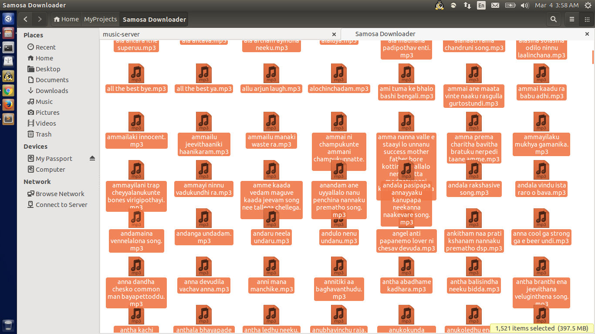
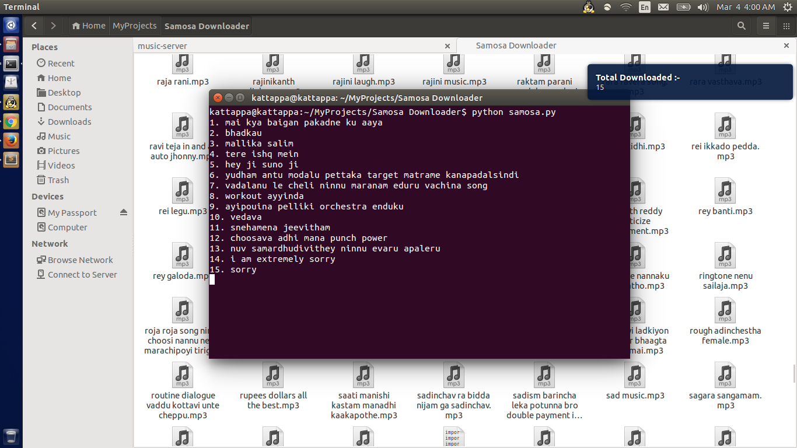

# Samosa-Clips-Auto-Downloader
### Python Script to Download all Audio Clips and Movie Dialogues from getsamosa.in 

Recently while scrolling through my news feed in facebook, an aricle on [Samosa App](http://getsamosa.com/) in [Chai Bisket](http://chaibisket.com/samosa-hyderabad-startup/) came to my notice. I have gone through the article and found the concept of their startup very interesting and opened their website to see how that actually works. 

I was surprised to see their huge collection of movie dialogues, ringtones and many other. 

Seeing that, I got a very bad idea of downloading all those clips to my laptop. Without any delay, I started to look at their source code and to my surprise they were using JSON requests to render those clips from the server.That made my efforts even more easier. 

Then I started writing the python script to download those clips from their site. In each request, I was able to download 15 clips. 

To avoid any unneccessary attention and blockage, I made the script to run every 10 seconds. I kept the script to run for 2 hours and I was able to download nearly 1500 clips from their site.

###Snapshots:

### Steps to avoid them:
* Using authorisation or access token for requests
* Limiting the no. of requests from each user
* Blocking unauthorised requests

#### License

MIT © [Sunil Tatipelly](http://suniltatipelly.in)

